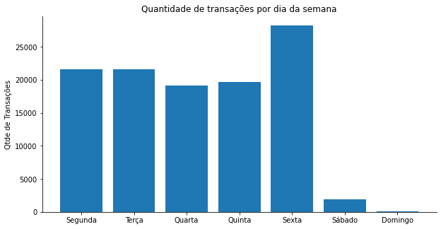
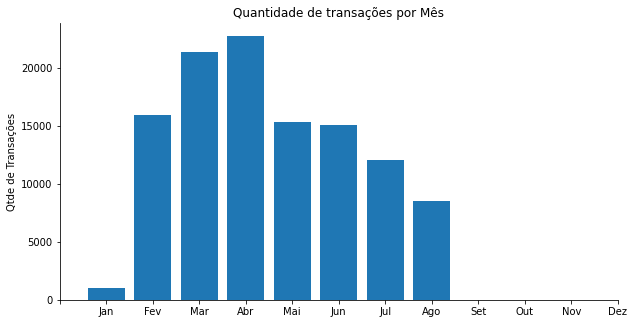
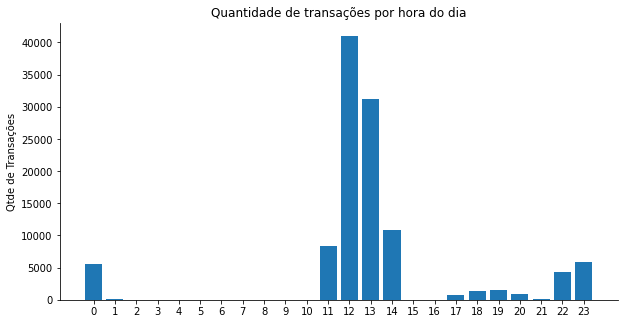
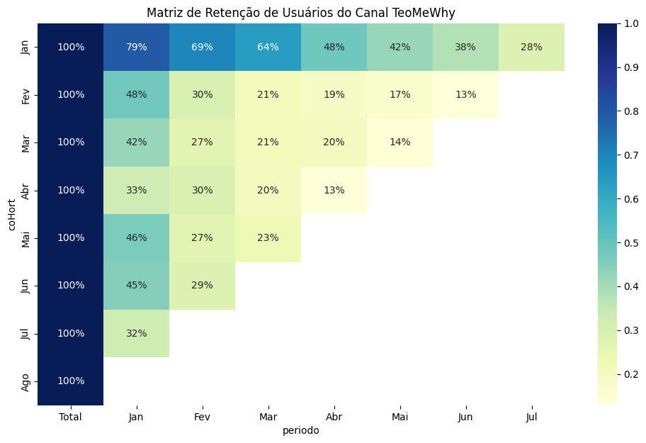

## 1. Introdução e escopo
### Objetivo do modelo

Este modelo possui como objetivo estimar a probabilidade de Churn (abandono) de um usuário no canal Téo Me Why, com base nos dados que temos no datalake.

O churn é definido como abandono do canal após um período de 28 dias sem transação.

É esperado que a utilização do modelo ajude a reduzir a taxa de churn, e por consequência aumente a movimentação na comunidade do canal TeoMeWhy.

### Histórico de versões

| Versão | Data | Responsáveis | Descrição |
| ------ | ------ | ------ | ------ |
| V1.0 | 26/08/2024 | Ana Paula Barros Ramos e Maria Fernanda O. Silvestre | Desenvolvimento do modelo de Churn de Usuários |

### Visão regulatória

No escopo do churn, não existem regulamentações que tenham impacto no tema.

### Papéis e responsabilidades

O projeto será realizado conjuntamente pelas áreas, responsáveis e ponto focal indicados abaixo.

| Papel/Atividade | Área responsável | Ponto focal |
| -------- | -------- | -------- |
| Descrição do Processo | Sistemas de ponto do Canal TeoMeWhy | Canal TeoMeWhy |
| Disponibilização dos Dados | Databricks | Canal TeoMeWhy & MeD |
| Análise Exploratória Inicial | Análise de Dados | Ana Paula e Maria Fernanda |
| Desenvolvimento do Modelo | Ciência de Dados | Ana Paula e Maria Fernanda |
| Validação da Metodologia | Validação do Modelo | Canal TeoMeWhy |

### Público alvo

O público alvo considerado para a construção do target deste modelo foi selecionado a partir das características abaixo:
* Transações de usuários realizadas nos períodos entre as seguintes datas de referência: 01/02/2024, 01/03/2024, 01/04/2024, 01/05/2024, 01/06/2024, 01/07/2024, 01/08/2024 e seus últimos 28 dias antecedentes.

### Target

A variável target do modelo é do tipo binária e será construída avaliando as transações realizadas pelos usuários na respectiva data de referência.
Churn: usuário abandona o canal em até 28 dias após a data de referência.
Não Churn: caso contrário.

### Bases de dados utilizadas

As bases de dados utilizadas com as respectivas informações são apresentadas na tabela abaixo:

| Base de dados | Datas base de referência | Quantidade de observações | Fonte de informação | Responsável pela disponibilização |
| ------ | ------ | ------ | ------ | ------ |
| Transações no Sistema de Pontos | 27/Jan/2024 a 23/Ago/2024 | 126.602 | Databricks (transacoes) | Teo Me Why |
| Transações e Identificação do Produto | 27/Jan/2024 a 23/Ago/2024 | 126.958 | Databricks (transacao_produto) | Teo Me Why |
| Clientes | 27/Jan/2024 a 23/Ago/2024 | 1772 | Databricks (cliente) | Teo Me Why |

### Descrição das variáveis

> A tabela analítica resultado do estudo (ABT) utilizada com as respectivas informações
> são apresentadas na tabela abaixo (TABLE abt_churn_project_churn):

| Variável | Tipo | Descrição |
| ----- | ----- | ----- |
| dtRef | Data | Data Referência (Safra) |
| idCliente | Texto | Identificador do Cliente |
| flChurn | Número | Target (churn ou não churn) |
| nrSomaPontos | Número | Soma dos Pontos |
| nrSomaPontosPos | Número | Soma dos Pontos Positivos |
| nrSomaPontosNeg | Número | Soma dos Pontos Negativos |
| nrTicketMedio | Número | Ticket Médio dos Pontos |
| nrTicketMedioPos | Número | Ticket Médio Positivo |
| nrTicketMedioNeg | Número | Ticket Médio Negativo |
| nrPontosDia | Número | Média Pontos por Dia |
| nrQtdeTransacoes | Número | Quantidade Total de Transações |
| nrQtdeDias | Número | Quantidade de Dias de Transações |
| nrRecenciaDias | Número | Recência (Tempo em Dias da última transação) |
| nrQtdeTransacaoDay2 | Número | Quantidade de Transações na Segunda-feira |
| nrQtdeTransacaoDay3 | Número | Quantidade de Transações na Terça-feira |
| nrQtdeTransacaoDay4 | Número | Quantidade de Transações na Quarta-feira |
| nrQtdeTransacaoDay5 | Número | Quantidade de Transações na Quinta-feira |
| nrQtdeTransacaoDay6 | Número | Quantidade de Transações na Sexta-feira |
| nrQtdeDay2 | Número | Quantidade de Dias na Segunda-feira |
| nrQtdeDay3 | Número | Quantidade de Dias na Terça-feira |
| nrQtdeDay4 | Número | Quantidade de Dias na Quarta-feira |
| nrQtdeDay5 | Número | Quantidade de Dias na Quintaa-feira |
| nrQtdeDay6 | Número | Quantidade de Dias na Sexta-feira |
| nrAvgRecorrencia | Número | Média de Recorrência entre uma transação e outra |
| varProdutosAcessados | Número | Variedade dos Produtos Acessados |
| qtdeProdChatMessage | Número | Mandou uma mensagem no chat (Top 1) | 
| qtdeProdListaPresenca | Número | Digitou !presente na Live (Top 2) |
| qtdeProdChurn5pp | Número | Digitou !profile e teve prob de churn < 5% (Top 3) |
| qtdeProdPresencaStreak | Número | Digitou !presente por 5 dias consecutivos (Top 4) |
| qtdeProdResgatarPonei | Número | Resgatou Pôneis da Twitch (Top 5) |
| qtdeProdTrocaPontosStreamElements | Número | Digitou !troca e trocou pontos por DtPoints (Top 6) |
| qtdeProdChurn10pp | Número | Digitou !profile e teve prob de churn < 10% (Top 7) |
| qtdeProdDailyLoot | Número | Resgatou Loot Diário de RPG (Top 8)|
| qtdeProdChurn2pp | Número | Digitou !profile e teve prob de churn < 2% (Top 9)|
| qtdeProdAirflowLover | Número | Citou o Airflow no chat (Top 10) |
| turnoMaisFrequente | Texto | Turno do usuário mais frequente de transações |

### Premissas e Limitações
* Premissas
  * O usuário pode se manter no canal em um determinado mês, abandonar o canal em um outro mês e retornar ao canal.
  * Existe três tipos de pontos no sistema de pontos do canal e alguns podem ser trocados em pontos de um outro tipo ou por itend na loja virtual. A base disponibiliza os pontos apenas do tipo Cubos, que são os pontos de CRM.
  
* Limitações
  * Usuários que abandonam o canal e retornam antes do primeiro dia do mês subsequente não serão corretamente identificados como tendo abandonado.
  * A base de dados está limitada a poucos meses (Fev a Ago) de um único ano.

## 2. Metodologia

### Análise Exploratória
Inicialmente, foi realizada uma exploração com python para identificar as principais características dos dados das bases de origem. Foram extraídas as informações de estatística descritiva da tabela de `silver.upsell.cliente` utilizando a função.describe(), seguindo para a análise de missings para os campos dessa base de dados, para identificar possíveis pré-processamentos necessários.

O proceso foi realizado também para a tabelas `silver.upsell.transacoes`. Na segunda tabela, além das estatísticas descritivas foram geradas alguns gráficos com a biblioteca matplotlib.

  
  
    
  

Além da análise dos dados brutos também foi construída uma matriz de retenção para entender o comportamento dos usuário do canal. Nela é possível acompanhar a taxa de retenção dos usuários a cada mês desde o mês com o primeiro acesso.

  

### Descrição das técnicas utilizadas

- Tipo: Análise Bidimensional (Correlação de Spearman), Classificação (Random Forest). Considerando que as variáveis númericas seguem uma distribuição multimodal, foi utilizado o método de Spearman, para a análise das correlações entre as variáveis, por ser mais robusta e menos sensível a distribuições não normais e relações não lineares.
- Tipo de aprendizado: Supervisionado.
  * Etapas do Pipeline:
    * Pré-processamento: ColumnTransformer: Variáveis Númericas (SimpleImputer > StandardScaler); Variáveis Categóricas (SimpleImputer > OneHotEncoder).
    * Seleção de variáveis:
      * DropConstantFeatures: remoção features constantes que não fornecem variação ou informação útil ao modelo, reduzindo o risco de overfitting e melhorando a eficiência do treinamento.
      * DropCorrelatedFeatures: eliminação de features altamente correlacionadas, essa técnica previne a multicolinearidade, que pode distorcer os pesos atribuídos pelo modelo e afetar negativamente a interpretabilidade e a performance.
      * RFE (Logistic Regression): uso da Recursive Feature Elimination (RFE) para selecionar iterativamente as features mais importantes, removendo as menos relevantes em cada iteração com base em uma regressão logística, o que melhora a performance ao focar nas features que mais impactam o resultado.
      * GridSearch: otimização dos hiperparâmetros da Random Forest, explorando várias combinações para encontrar a que oferece o melhor desempenho, de modo que o modelo seja ajustado de forma a maximizar sua precisão e generalização.
- Variável resposta: binária (flChurn).
- Variáveis explicativas/features: variáveis originais (dtRef e idCliente) e engenhadas a partir dos dados presentes no datalake (descNomeProduto, nrPontosTransacao, dtTransacao(Time)).

### Resultados obtidos
- Desempenho do Modelo

  O modelo de Random Forest apresentou um bom desempenho geral, conforme indicado pelas métricas de avaliação. A acurácia nos dados de treino foi de 85.40%, enquanto nos dados de teste foi de 80.92%, sugerindo que o modelo está generalizando bem, com uma pequena redução de desempenho ao ser aplicado em novos dados.

- AUC (Área Sob a Curva ROC)
  
A AUC, que mede a capacidade do modelo de distinguir entre as classes, foi de 0.9318 no treino e 0.8427 no teste. Esses valores indicam um excelente desempenho nos dados de treino e um bom desempenho nos dados de teste, embora com uma ligeira diminuição na capacidade de discriminação em dados não vistos.

- Métricas de Classificação (Precision, Recall e F1-Score)
  
Métricas de Classificação (Precision, Recall e F1-Score)
As métricas de precision, recall e f1-score fornecem uma visão mais detalhada sobre o desempenho do modelo para cada classe. Vamos analisar para as classes 0 e 1:

 * Conjunto Dados de Treino
   * Classe 0:
      * Precision: 0.89
      * Recall: 0.62
      * F1-Score: 0.73
   * Classe 1:
     * Precision: 0.84
     * Recall: 0.96
     * F1-Score: 0.90
       
 Nos dados de treino, a classe 0 tem uma alta precisão (0.89), o que significa que, das previsões feitas para a classe 0, 89% estavam corretas. No entanto, o recall é relativamente baixo (0.62), indicando que o modelo não está capturando todas as instâncias da classe 0. A classe 1, por outro lado, tem um excelente desempenho em todas as métricas, com destaque para o recall de 0.96, mostrando que o modelo é muito eficaz em identificar as instâncias da classe 1.

 * Conjunto Dados de Teste
   * Classe 0
      * Precision: 0.82
      * Recall: 0.56
      * F1-Score: 0.66
   * Classe 1:
      * Precision: 0.81
      * Recall: 0.94
      * F1-Score: 0.87
        
 Nos dados de teste, o desempenho para a classe 0 é inferior ao do treino, com um recall de apenas 0.56, o que indica que o modelo falha em identificar corretamente uma proporção significativa de instâncias da classe 0. A classe 1 mantém um bom desempenho, especialmente no recall (0.94), o que reforça a tendência observada nos dados de treino.

 Em resumo, o modelo de Random Forest mostra um bom equilíbrio entre precisão e generalização, mas com uma tendência a identificar melhor a classe 1, o que pode sugerir a necessidade de ajustes adicionais de balanceamento dos dados para melhorar o desempenho em ambas as classes, especialmente na classe 0.

### Macro fluxo da solução

...

### Planos de ação
* Envio por e-mail de notificações e lembretes personalizados sobre eventos ao vivo em horários diferentes, produtos disponíveis, mantendo os usuários informados e envolvidos.
* Conduzir uma pesquisa de satisfação abrangente com perguntas qualitativas e abertas dos motivos para não retorno ao canal.

## 3. Conclusão

### Deploy
* Periodicidade da escoragem: mensal;
* Tipo de disponibilização: tabela SQL;
* Local da disponibilização: Databricks;
* Ponto focal da disponibilização: Teo Me Why.
  
### Acompanhamento do modelo/estudo
* Performance do Modelo: Curva ROC, acurácia, recall e precisão no conjunto de treino.
* Taxa do target: no conjunto de treino, garantindo um fiel balanceamento dos dados.
  
O modelo mostra um desempenho geral sólido, especialmente na classe majoritária (1), com boa generalização nos dados de teste. As métricas de AUC sugerem que o modelo tem uma boa habilidade discriminativa, embora o desempenho na classe minoritária (0) possa ser melhorado, possivelmente por meio de técnicas adicionais de balanceamento de classes ou ajustes na seleção de features. O uso de técnicas como GridSearch e RFE ajudou a refinar o modelo, embora o foco em melhorar a recall da classe minoritária poderia ser uma área de otimização futura.

### Roadmap de melhorias
* Análise para tratamento de Outliers;
* Plano de ação para coletar novos dados;
* Acrescentar a feature mesRef quando a base de dados for mais abrangente (diferentes) anos. 
* Aplicação de técnicas adicionais de balanceamento de classes;
* Segmentação de Usuários: segmentar os usuários com base em comportamento (frequência de interação, produtos adquiridos, etc.) para identificar grupos mais propensos a churn.
